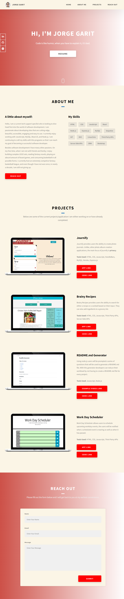

# Jorge Garit Portfolio

#### Professional Portfolio For Coding Bootcamp and On
Changes being made as classwork gets completed.

## Built With 
HTML / CSS

## Header
Header includes my name on the top left side and also includes the four sections of the webpage all with active links to their respective areas. The header is also positioned sticky so will always appear on top of webpage. 

## About Me
The About Me section includes a photo of myself while enjoying a wonderful vacation to the beautiful state of depression. It also includes a little bio about why I am taking this bootcamp and what i am hoping to get out of it. 

## My Work
The My Work section includes the current projects I have worked on for the bootcamp as well as placeholders for future projects. The Run Buddy and Horiseon section are clickable and will take you to their respective URL's. While the other three are just placeholder (for now) they are clickable as well and will take you to my github page. 

## Contact Me
The Contact Me sections includes four easy ways to reach me, the phone is set up to be dialed with just one click. The email will generate an email field and the github and linkedin sections will take you to those pages. 

## Resume (work in progress)
At the current moment while the resume otation does exist in the header, there is no resume section. It will be added in the future. 

# Footer
The footer includes a note about Jorge Garit being who designed this page

# Screenshot of Portfolio Site

# URL of Deplyed Website
Click [here](https://jorgegarit.github.io/Portfolio/) to view my deployed application. 

#### Hope You Enjoyed This Read Me 🤓
